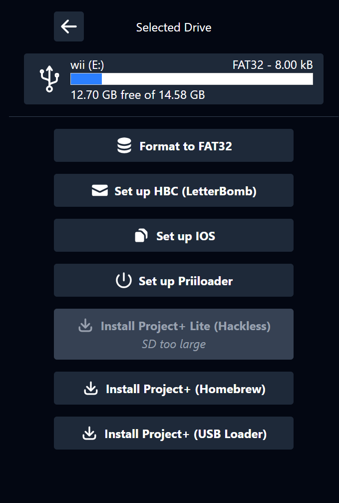

  <h3 align="center">jankbox</h3>
  

    A mod manager for Wii softmodding, Project+ and Project M
  

## About the project

  

jankbox is a desktop application with the goal of simplifying Wii softmodding and installing mods such as [Project+](https://projectplusgame.com) and [Project M](https://en.wikipedia.org/wiki/Project_M).
It helps users by managing files on their SD cards and USB drives.

## Built With

- [Electron](https://www.electronjs.org/)
- TypeScript
- React
- Tailwind CSS

## Getting Started with Development

- `npm install`
- `npm run dev`

## Installation

jankbox is in early development and there is no release or download for regular users yet.

## Roadmap

- [ ] Individual features ("Advanced Mode")
  - [x] List removable drives
  - [x] Format SD/USB to FAT32
  - [x] Generate and copy Letterbomb files to SD card
  - [x] Download IOS 56 and create a WAD file
  - [ ] Patch IOS 56 with d2x cIOS
  - [ ] Set up a WAD manager homebrew app for 1-click d2x installation
  - [ ] Set up Priiloader
  - [ ] Install the different versions of Project+
  - [ ] Install the different versions of Project M 3.6
  - [ ] Verify game ISO, split to WBFS files, copy to USB
  - [ ] Set up USB Loader GX for P+ or PM
  - [ ] Project+ configurator (Gecko codes)
  - [ ] Set up Slippi Nitendont + game ISO verification and copying
- [ ] Installation wizard ("Guided Mode")
- [ ] Download manager

## Contributing

Pull requests are welcome.

## License

Distributed under the MIT license. See `LICENSE` for more information.

## Contact

Function - [@Function on Mastodon](https://norden.social/@function) - function (at) mailbox (dot) org

## Acknowledgments

- [wiibrew.org](https://wiibrew.org/)
- [Letterbomb / please.hackmii.com by fail0verflow](https://github.com/fail0verflow/letterbomb)
- [NinjaCheetah](https://ninjacheetah.dev/)
- [libWiiPy by NinjaCheetah](https://github.com/NinjaCheetah/libWiiPy)
- [ModMii by XFlak](https://github.com/modmii)
- [Nintendo Homebrew Discord](https://discord.gg/C29hYvh)
